  

  

 

### Sobre mí

Ayudo a las organizaciones a proteger su información de forma ordenada y medible. Diseño e implemento sistemas de gestión de seguridad, evalúo riesgos y preparo a los equipos para responder cuando algo sale mal. También me dedico a la capacitación, porque la seguridad solo funciona cuando las personas la entienden.

Creo en la seguridad que se integra a la operación diaria y se puede demostrar con evidencia, no solo en papel.

 

### Especialidades

  

 

### Contacto

  

<!--
  Secciones listas para activar cuando haya más actividad pública:

  Serpiente de contribuciones (la genera .github/workflows/snake.yml en la rama "output"):
  

    <picture>
      <source media="(prefers-color-scheme: dark)" srcset="https://raw.githubusercontent.com/adriangzmncrz-arch/adriangzmncrz-arch/output/github-snake-dark.svg" />
      <source media="(prefers-color-scheme: light)" srcset="https://raw.githubusercontent.com/adriangzmncrz-arch/adriangzmncrz-arch/output/github-snake.svg" />
      
    </picture>
  

  Estadísticas:
  

    
    
  

-->
